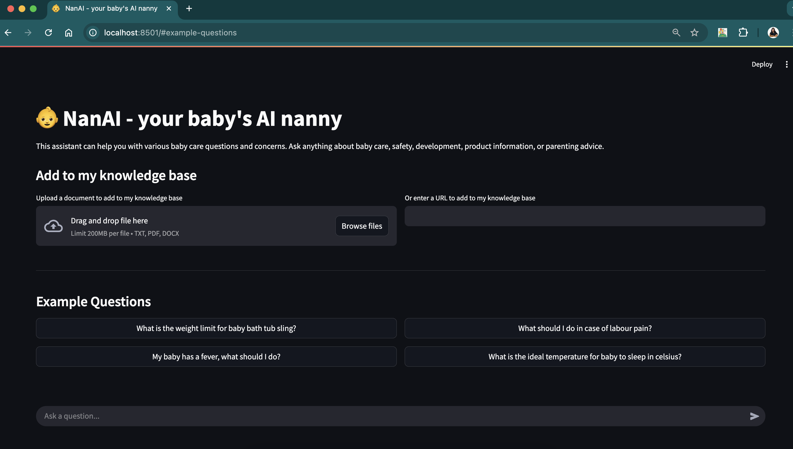

# NanAI - Your Baby's AI Nanny 👶

A RAG-powered AI assistant that helps parents with baby care advice, combining document knowledge with real-time web information. Built with Streamlit, Google's Gemini Flash model and Ollama nomic-embed-text open embedding model, and FAISS for efficient semantic search.

NanAI is an intelligent assistant designed to help parents with various aspects of baby care. It provides expert guidance on baby care, safety, development, product information, and parenting advice through an easy-to-use web interface.



## ✨ Features

- 🤖 AI-powered responses to baby care questions
- 📚 Knowledge base that can be expanded with custom documents
- 🌐 Support for adding information from web URLs
- 💬 Interactive chat interface
- 📱 User-friendly web application built with Streamlit

## 🛠️ Technology Stack

### Key Technologies

- **[Streamlit](https://streamlit.io/)**: Provides the web interface and real-time interaction capabilities
- **[Google Generative AI](https://ai.google.dev/)**: Powers the core language model for understanding and generating responses
- **[LlamaIndex](https://www.llamaindex.ai/)**: Handles document processing, chunking, and indexing
- **[FAISS](https://github.com/facebookresearch/faiss)**: Facebook AI Similarity Search for efficient vector similarity search and clustering
- **Async Processing**: Handles concurrent requests and document processing

This demo showcases how these technologies can be combined to create an intelligent assistant that:

1. Maintains a growing knowledge base through:
   - Document uploads (PDF, TXT, DOCX)
   - Web content ingestion via URLs
2. Provides contextually relevant responses using RAG (Retrieval-Augmented Generation)
3. Learns from new information sources in real-time
4. Delivers interactive responses through a user-friendly interface

## 🚀 Getting Started

### Prerequisites

- Python 3.10
- [uv](https://github.com/astral-sh/uv) - Fast Python package installer and resolver

### Installation

#### Option 1: Clone and Install

1. Clone the repository:

```bash
git clone <repository-url>
cd baby-care-agent
```

2. Create and activate a virtual environment:

```bash
uv venv
source .venv/bin/activate  # On Windows, use `.venv\Scripts\activate`
```

3. Install dependencies using uv:

```bash
uv pip install -e .
```

#### Option 2: Quick Start with uv

1. Create a new directory and initialize the project:

```bash
mkdir baby-care-agent
cd baby-care-agent
```

2. Initialize with uv:

```bash
uv venv
source .venv/bin/activate  # On Windows, use `.venv\Scripts\activate`
```

3. Clone and set up the project:

```bash
git clone https://github.com/rohinigaonkar/baby-care-agent.git .
uv pip install -e .
```

4. Set up environment variables:

```bash
cp env-template .env
```

Edit the `.env` file with your required API keys and configurations.

### Running the Application

Start the Streamlit application:

```bash
streamlit run app.py
```

The application will be available at `http://localhost:8501` by default.

## 💡 Usage

1. **Ask Questions**: Use the chat interface to ask any baby care related questions
2. **Add Knowledge**: Upload documents or provide URLs to expand the assistant's knowledge base
3. **Example Questions**: Try the pre-loaded example questions to get started

## 📁 Project Structure

- `app.py` - Main Streamlit application
- `agent.py` - Core agent implementation
- `perception.py` - Handles input processing
- `memory.py` - Manages knowledge storage and retrieval
- `decision.py` - Decision-making logic
- `action.py` - Action execution
- `models.py` - Data models
- `documents/` - Directory for storing knowledge base documents
- `faiss_index/` - Vector store for document embeddings

## 📦 Dependencies

- streamlit - Web application framework
- faiss-cpu - Vector similarity search
- google-genai - AI model integration
- llama-index - Document processing and indexing
- Other dependencies listed in `pyproject.toml`


