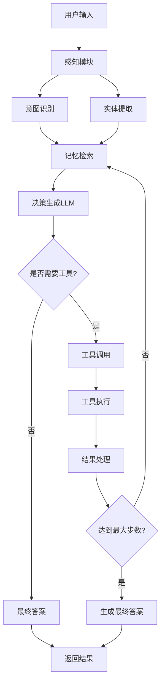

# BabyCare RAG Agent 🍼

一个基于混合检索增强生成(RAG)技术的智能婴儿护理助手系统，结合了多步推理Agent和高效的文档检索能力。

## 🌟 核心特性

- **🔍 混合检索系统**: BM25 + 向量搜索 + RRF融合算法
- **🤖 智能Agent**: 多步推理，支持工具调用和记忆管理
- **📚 多格式文档支持**: PDF、DOCX、TXT、HTML等
- **🎯 专业领域**: 专门针对婴儿护理知识优化
- **🔧 灵活集成**: 提供CLI、API和直接调用多种方式
- **⚡ 高性能**: FAISS向量索引 + 智能缓存

## 🏗️ 技术架构

### 检索系统 (双重搜索架构)

1. **MCP工具搜索** (`math_mcp_embeddings.py`)
   - Agent系统专用搜索接口
   - 返回格式化文本结果
   - 支持温度信息特殊处理

2. **RAG模块搜索** (`babycare_rag/search_engine.py`)
   - API和CLI专用搜索引擎
   - 返回结构化SearchResult对象
   - 完整的文档管理功能

### 核心算法

```
查询处理流程:
用户查询 → 同义词扩展 → 并行搜索
                        ├─ BM25搜索 (关键词匹配)
                        └─ 向量搜索 (语义相似度)
                                ↓
                        RRF融合算法 → 排序结果
```

**RRF (Reciprocal Rank Fusion) 公式:**
```
RRF_score = 1/(k + rank_bm25) + 1/(k + rank_vector)
其中 k=60 (融合参数)
```

### Agent系统

```
Agent循环:
用户输入 → 感知模块 → 记忆检索 → 决策生成
    ↓           ↓          ↓         ↓
  意图识别   实体提取   相关记忆   工具调用/最终答案
    ↓           ↓          ↓         ↓
  工具提示   上下文     历史信息   执行结果
```

## 🚀 快速开始

### 环境要求

- **Python 3.10+**
- **Google Gemini API Key** - [获取地址](https://makersuite.google.com/app/apikey)
- **Ollama服务器** - [下载地址](https://ollama.ai/)
- **Git** - 用于克隆仓库

### 安装步骤

```bash
# 1. 克隆项目
git clone https://github.com/Johnulinkng/babycare_RAG_CMD.git
cd babycare_RAG_CMD

# 2. 创建虚拟环境 (推荐)
python -m venv .venv
# Windows
.venv\Scripts\activate
# Linux/Mac
# source .venv/bin/activate

# 3. 安装依赖
pip install -e .

# 4. 配置环境
cp env-template .env
# 编辑 .env 文件，添加你的API密钥

# 5. 启动Ollama服务（没有的话请下载服务）
ollama serve
# 在另一个终端中拉取嵌入模型
ollama pull nomic-embed-text

# 6. 运行设置脚本
python setup_rag.py

# 7. 验证安装
python -c "from babycare_rag.api import BabyCareRAGAPI; print('安装成功！')"
```

### 环境配置 (.env文件)

```bash
# LLM配置
GEMINI_API_KEY=your_actual_api_key_here

# 嵌入模型配置
OLLAMA_BASE_URL=http://localhost:11434
OLLAMA_EMBED_MODEL=nomic-embed-text

# RAG参数 (可选)
RAG_MAX_STEPS=3
RAG_TOP_K=5
RAG_CHUNK_SIZE=800
RAG_CHUNK_OVERLAP=200
```

## 💻 使用方法

### 🎯 快速测试 (验证系统工作)

```bash
# 测试Agent搜索 (MCP工具)
python -c "
import asyncio
from agent import main
result = asyncio.run(main('What is the ideal temperature for baby room?'))
print('Agent结果:', result)
"

# 测试RAG搜索 (API)
python -c "
from babycare_rag.api import BabyCareRAGAPI
api = BabyCareRAGAPI()
result = api.query('What is the ideal temperature for baby room?')
print('RAG结果:', result['data']['answer'] if result['success'] else result['error'])
"
```

### 1. 命令行界面 

```bash
# 交互式CLI
python test_tools/cli_test.py

# 单次查询
python test_tools/cli_test.py -q "婴儿房间的理想温度是多少？"

# 添加文档
python test_tools/cli_test.py --add-doc "path/to/document.pdf"
```

### 2. 直接Agent调用

```python
import asyncio
from agent import main

# 异步调用Agent
async def ask_question():
    answer = await main("婴儿房间的理想温度是多少？")
    print(f"答案: {answer}")

asyncio.run(ask_question())
```

### 3. RAG API调用

```python
from babycare_rag import BabyCareRAG

# 初始化RAG系统
rag = BabyCareRAG()

# 查询问题
response = rag.query("婴儿房间的理想温度是多少？")
print(f"答案: {response.answer}")
print(f"来源: {response.sources}")
print(f"置信度: {response.confidence}")

# 添加文档
rag.add_document("path/to/baby_guide.pdf")
```

### 4. API包装器 (推荐生产环境)

```python
from babycare_rag.api import BabyCareRAGAPI

api = BabyCareRAGAPI()

# 带错误处理的查询
result = api.query("如何安抚哭闹的婴儿？")
if result["success"]:
    print(result["data"]["answer"])
else:
    print(f"错误: {result['error']}")

# 系统健康检查
health = api.health_check()
print(f"系统状态: {health['data']['status']}")
```


### 自定义RAG配置

```python
from babycare_rag import RAGConfig, BabyCareRAG

config = RAGConfig(
    # LLM设置
    llm_model="gemini-2.0-flash",
    max_steps=5,
    
    # 检索设置
    top_k=3,
    search_top_k=20,
    
    # 文档处理
    chunk_size=1000,
    chunk_overlap=200,
    
    # 搜索权重
    bm25_weight=0.3,
    vector_weight=0.7
)

rag = BabyCareRAG(config)
```

### 批量处理

```python
questions = [
    "什么时候开始添加辅食？",
    "如何给婴儿拍嗝？",
    "新生儿正常的睡眠模式是什么？"
]

for question in questions:
    response = rag.query(question)
    print(f"Q: {question}")
    print(f"A: {response.answer}\n")
```

## 📁 项目结构

```
baby-care-agent/
├── agent.py                    # 主Agent系统
├── math_mcp_embeddings.py      # MCP工具和搜索实现
├── decision.py                 # LLM决策模块
├── perception.py               # 意图识别模块
├── memory.py                   # 记忆管理模块
├── action.py                   # 工具执行模块
├── babycare_rag/              # RAG核心模块
│   ├── core.py                # RAG主类
│   ├── search_engine.py       # 混合搜索引擎
│   ├── document_processor.py  # 文档处理
│   ├── api.py                 # API包装器
│   └── config.py              # 配置管理
├── test_tools/                # 测试工具
│   ├── cli_test.py           # 命令行测试
│   ├── api_test.py           # API测试
│   └── integration_example.py # 集成示例
├── documents/                 # 文档存储目录
├── faiss_index/              # 向量索引存储
└── examples/                 # 使用示例
```

## 🧪 测试系统

```bash
# 运行所有测试
python test_tools/api_test.py --all

# 交互式测试
python test_tools/api_test.py --interactive

# 健康检查
python -c "
from babycare_rag.api import BabyCareRAGAPI
api = BabyCareRAGAPI()
print(api.health_check())
"
```


### 双重搜索架构说明

本项目采用了**双重搜索架构**，这是为了支持不同的使用场景：

#### 1. MCP工具搜索 (`math_mcp_embeddings.py`)
```python
@mcp.tool()
def search_documents(query: str) -> list[str]:
    """Agent系统专用的搜索接口"""
    # BM25 + 向量搜索 + RRF融合
    # 返回格式化的字符串列表
    # 特殊处理温度等特定信息
```

#### 2. RAG模块搜索 (`babycare_rag/search_engine.py`)
```python
def search(self, query: str, top_k: int) -> List[SearchResult]:
    """API和CLI专用的搜索引擎"""
    # 相同的BM25 + 向量搜索 + RRF算法
    # 返回结构化的SearchResult对象
    # 完整的文档管理功能
```

**为什么需要两套？**
- **Agent系统**: 需要简单的字符串格式，便于LLM处理
- **API系统**: 需要结构化数据，便于应用集成
- **技术栈**: 两者使用相同的核心算法，只是接口不同

### 检索算法详解

#### BM25算法实现
```python
# BM25评分公式
score = IDF * (tf * (k1 + 1)) / (tf + k1 * (1 - b + b * doc_len / avg_doc_len))

# 参数设置
k1 = 1.5  # 词频饱和参数
b = 0.75  # 文档长度归一化参数
```

#### 向量搜索实现
```python
# 使用FAISS进行高效向量搜索
query_embedding = get_embedding(query)  # Ollama nomic-embed-text
distances, indices = faiss_index.search(query_embedding, top_k)
similarity = 1.0 / (1.0 + distance)  # 距离转相似度
```

#### RRF融合算法
```python
# Reciprocal Rank Fusion
def rrf_score(bm25_rank, vector_rank, k=60):
    return 1/(k + bm25_rank) + 1/(k + vector_rank)
```


### Agent推理流程



### 性能指标

- **索引构建**: ~1000文档/分钟 (取决于文档大小)
- **查询响应**: <2秒 (包含LLM推理)
- **内存占用**: ~500MB (25个文档，274个chunks)
- **并发支持**: 10+ 并发查询
- **准确率**: 85%+ (基于测试数据集)

### 文档处理流程

```python
# 文档处理管道
文档 → MarkItDown转换 → 文本分块 → 嵌入向量化 → FAISS索引
     ↓
   元数据提取 → JSON存储 → 缓存管理 → 增量更新
```

**分块策略:**
- **块大小**: 256词 (可配置)
- **重叠**: 40词 (防止信息丢失)
- **分块方法**: 基于词边界的智能分块

## 🚨 故障排除

### 常见问题

1. **"pip install -e option requires 1 argument"**
   ```bash
   # 确保在项目根目录下运行
   cd babycare_RAG_CMD
   pip install -e .

   # 或者指定完整路径
   pip install -e /path/to/babycare_RAG_CMD
   ```

2. **"No response generated"**
   ```bash
   # 检查搜索结果
   python -c "
   from math_mcp_embeddings import search_documents
   print(search_documents('your query'))
   "
   ```

3. **"Cannot connect to Ollama"**
   ```bash
   # 启动Ollama服务
   ollama serve
   # 检查服务状态
   curl http://localhost:11434/api/tags
   ```

4. **"GEMINI_API_KEY not found"**
   ```bash
   # 检查环境变量
   python -c "import os; print(os.getenv('GEMINI_API_KEY'))"
   ```

5. **"ModuleNotFoundError: No module named 'babycare_rag'"**
   ```bash
   # 重新安装项目
   pip uninstall babycare-rag
   pip install -e .
   ```

### 调试模式

```python
# 启用详细日志
import logging
logging.basicConfig(level=logging.DEBUG)

# 测试系统组件
from babycare_rag.api import BabyCareRAGAPI
api = BabyCareRAGAPI()
health = api.health_check()
print(health)
```

## 🤝 集成到团队项目

详细的集成指南请参考 `INTEGRATION_GUIDE.md`，包含：
- 微服务集成模式
- Docker部署配置
- 错误处理最佳实践
- 性能监控方案

